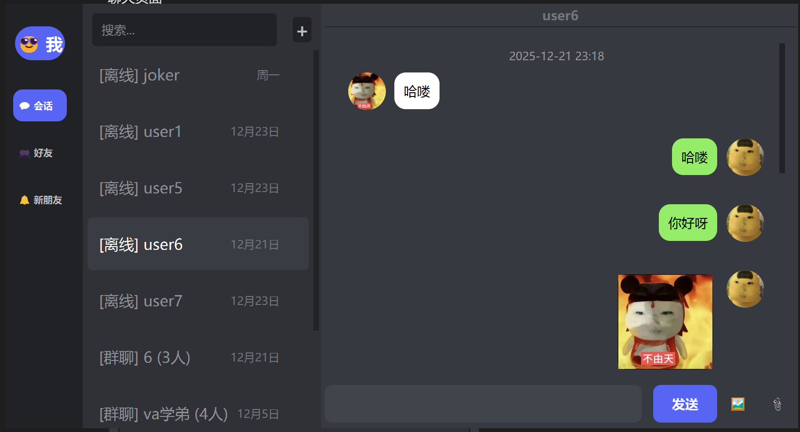
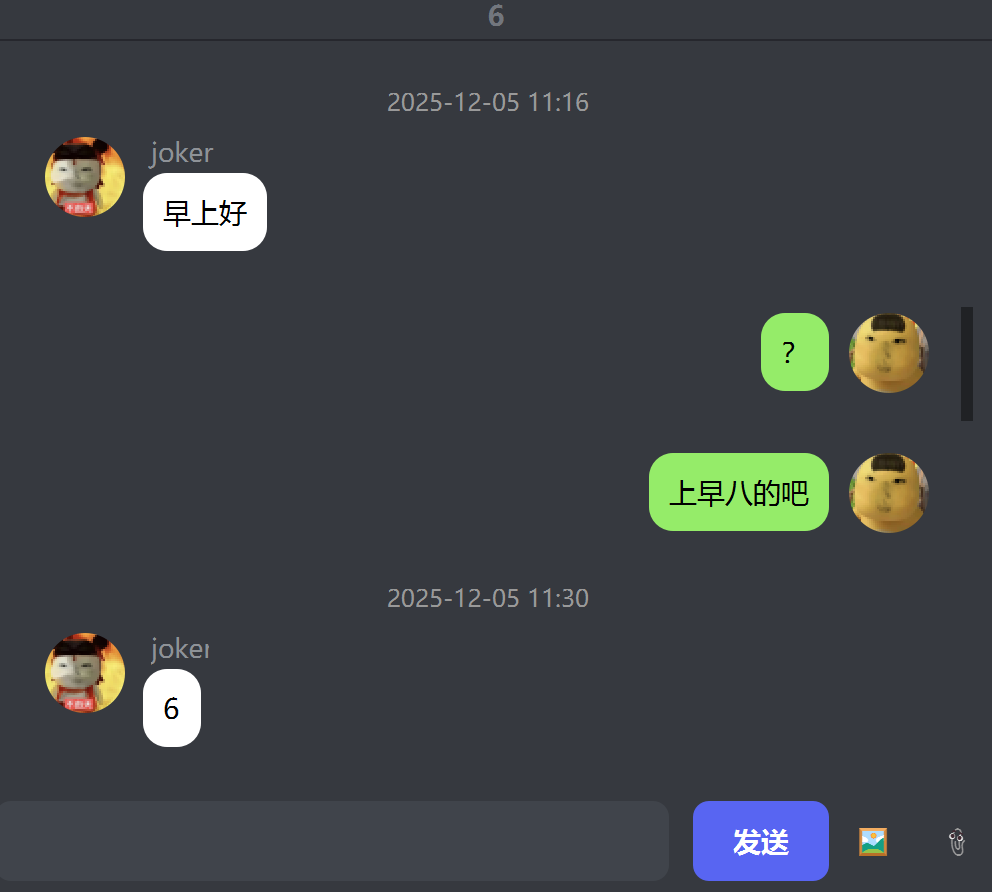
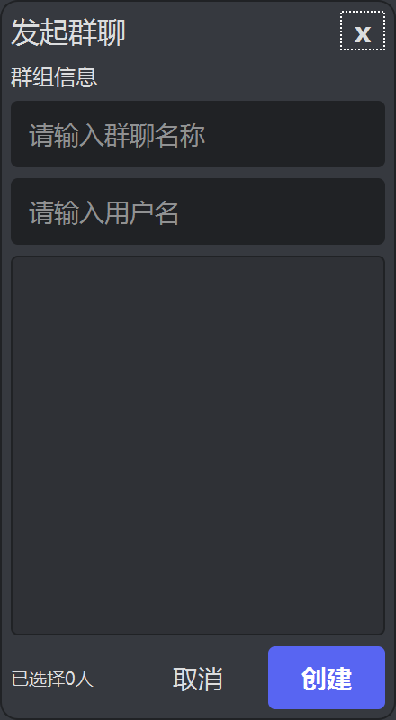
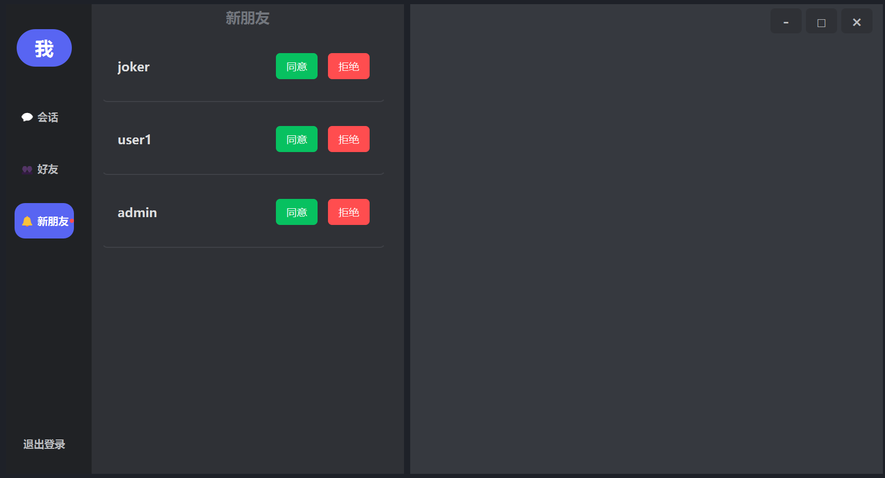

# LinkChat

LinkChat 是一个基于 C++17 和 Qt Widgets 的 C/S 即时通讯项目。项目包含客户端、服务端、公共协议库和压测工具，使用 TCP 长连接、自定义 PDU 协议和 MySQL/MariaDB 持久化实现账号、好友、私聊、群聊、离线消息和文件传输等功能。

## 功能概览

- 账号注册与登录：两阶段登录，密码使用随机 salt + SHA-256 后以 Base64 存储和传输。
- 好友系统：支持搜索用户、添加好友、处理好友申请、删除好友和好友在线状态通知。
- 聊天能力：支持私聊、群聊、历史消息、离线消息 ACK 后确认投递。
- 群组能力：支持创建群聊、邀请成员、查看成员、退群和群消息历史。
- 文件传输：支持 64KB 分片、ACK 确认、断点续传、取消通知和 MD5 校验。
- 网络恢复：客户端包含心跳、断线重连和传输恢复管理。

## 技术栈

| 模块 | 技术 |
| --- | --- |
| 语言 | C++17 |
| UI | Qt Widgets |
| 网络 | QTcpServer, QTcpSocket |
| 协议 | 自定义 PDUHeader + Body |
| 数据库 | MySQL / MariaDB, QSqlDatabase |
| 构建 | CMake |

## 项目结构

```text
LinkChat/
├── Client/       # Qt 客户端、聊天界面、文件传输和重连逻辑
├── Server/       # TCP 服务端、消息路由、数据库访问和连接池
├── common/       # 客户端和服务端共享的协议、加密、配置和日志代码
├── LoadTester/   # 压测和文件传输恢复测试
├── sql.sql       # 数据库初始化脚本
└── CMakeLists.txt
```

## 构建

确保本机已经安装：

- CMake 3.14 或更高版本
- Qt 5/6，包含 Core、Gui、Widgets、Network、Sql 模块
- MySQL 或 MariaDB，以及可用的 Qt MySQL 驱动

```bash
cmake -S LinkChat -B LinkChat/build/cmake-Debug
cmake --build LinkChat/build/cmake-Debug --config Debug
```

如果 Qt 没有加入环境变量，需要配置 `CMAKE_PREFIX_PATH`，例如：

```bash
cmake -S LinkChat -B LinkChat/build/cmake-Debug -DCMAKE_PREFIX_PATH="C:/Qt/6.x.x/mingw_64"
```

## 数据库初始化

在 MySQL 中执行：

```sql
SOURCE LinkChat/sql.sql;
```

脚本会创建 `linkchat` 数据库和项目所需表结构。预置账号 `admin`、`user1`、`user2` 的演示密码均为 `123456`。

已有旧数据库需要补充离线投递字段：

```sql
ALTER TABLE t_offline_msg ADD COLUMN delivered TINYINT DEFAULT 0;
ALTER TABLE t_group_offline_msg ADD COLUMN delivered TINYINT DEFAULT 0;
```

## 运行

构建产物通常位于 `LinkChat/build/cmake-Debug/bin`：

1. 启动 `Server.exe`
2. 启动 `Client.exe`

首次运行会生成客户端和服务端配置文件。如果数据库账号、密码、主机或端口不同，请修改服务端配置中的 database 配置后重启服务端。

## 截图









